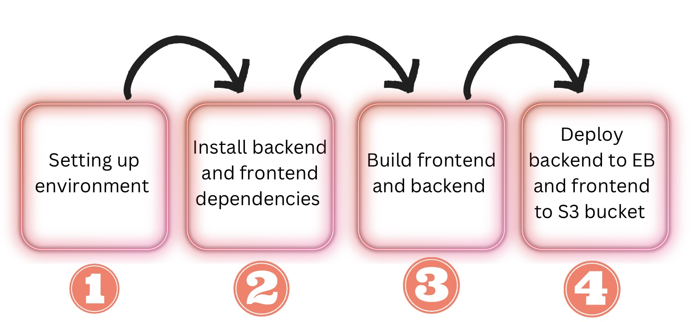

# Pipline Proccess

Pipline is connected to github via circleci to automate the build and deploying proccess

### Pipline commands:

- Setting up environment [ install nodejs, checking code ]
- Install backend and frontend dependencies [ `npm install` in both ]
- Build backend and frontend [ `npm run build` in both ]
- deploy api or backend to EB and frontend to S3 bucket
